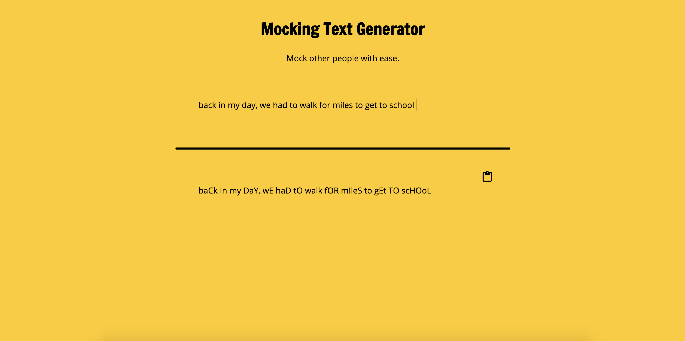
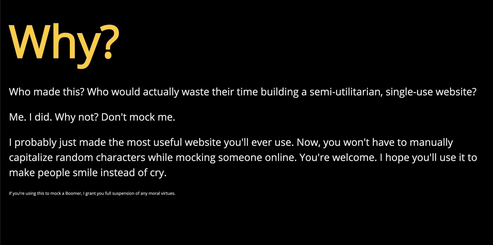

# Mocking Text Generator

A simplistic web app to generate randomly capitalized text based on user input.

## Motivation

I got tired of having to manually type and capitalize my messages online to mock people. Now, I can easily mock someone with the ease of a simple copy/paste.

## Recommended Usage

It is highly recommended you use this tool to mock Boomers. 

## Screenshots
Landing Page:

Background Information:

## Built With

* HTML5
* CSS3
* Javascript
* jQuery

## Demo

- [Live Demo](https://dannydi12.github.io/mocking-text-generator/)

## Authors

* **Daniel DiVenere** - Front-End development/styling
